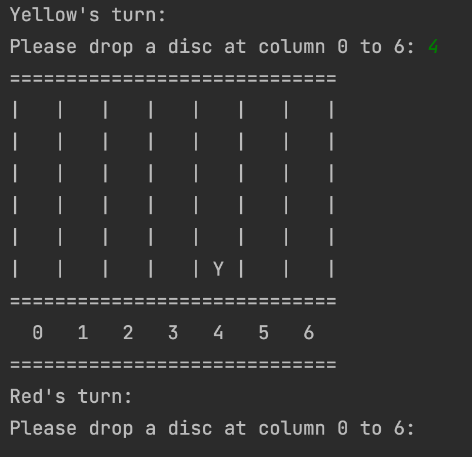

# connect-four-game-java

This project provides Dockerfile for building Docker Image of Connect 4
## Introduction

Connect 4 is a two-player game in which each player takes turns dropping colored discs into a vertical grid. The goal of the game is to connect four of one's own discs of the same color vertically, horizontally, or diagonally before your opponent does.

In this program, users will be able to input the column number in the command line to drop their disc in the desired column. 

Images:

    
        

## Requirements
 * Docker

## Start
- `docker build -t connect-four:latest .`
- `docker run -it --name connect4 connect-four:latest`